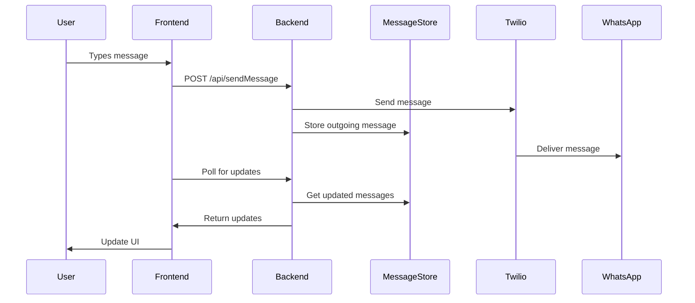
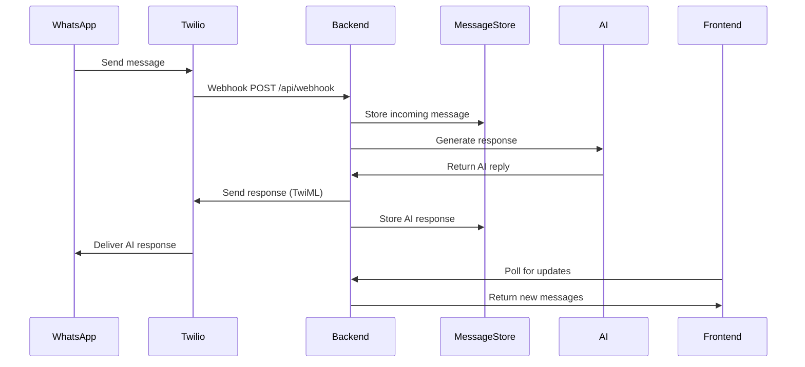
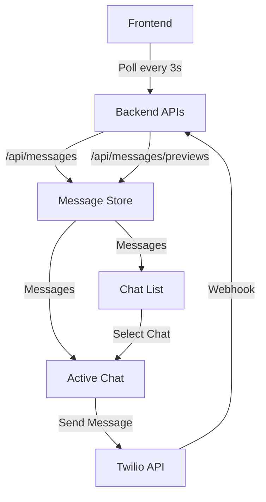

# WhatsApp AI Support Chat with Next.js + Twilio + Gemini

A fullstack Next.js application that integrates with Twilio's WhatsApp API and Google's Gemini AI to provide intelligent, automated customer support responses via WhatsApp, featuring separate chat views and real-time message handling.

## System Architecture

### Message Flow Diagrams

#### 1. Sending a Message

#### 2. Receiving a Message

#### 3. Chat Management System

## Component Interactions

### 1. Frontend Components
- **ChatList**: Shows all active conversations
- **ChatContainer**: Displays messages for selected chat
- **MessageInput**: Handles message composition and sending
- **SetupGuide**: Provides configuration instructions

### 2. Backend Services
- **Message API**: Handles message retrieval and storage
- **Webhook Handler**: Processes incoming Twilio messages
- **AI Service**: Generates intelligent responses
- **MessageStore**: Manages chat state and history

### 3. External Services
- **Twilio API**: Handles WhatsApp message delivery
- **Gemini AI**: Provides intelligent response generation

## Features

- 📱 **WhatsApp Integration**: Receive and send WhatsApp messages via Twilio API
- 🤖 **AI-Powered Support**: Intelligent responses using Google's Gemini AI
- 💬 **Real-time Chat UI**: Modern chat interface with shadcn/ui components
- ✨ **Smart Suggestions**: AI-generated response suggestions for support agents
- 🔄 **Auto-refresh**: Polls for new messages every 3 seconds
- 📦 **In-memory Storage**: Simple message storage for POC purposes
- 🎨 **Modern UI**: Built with shadcn/ui and TailwindCSS
- 🔒 **Secure**: Environment variables for sensitive API credentials
- 🧠 **Context-Aware**: AI responses consider conversation history

## Tech Stack

- **Frontend**: Next.js 14 (App Router), React 18, shadcn/ui, TailwindCSS, TypeScript
- **Backend**: Next.js API Routes, Twilio Node.js SDK, Google Generative AI
- **AI**: Google Gemini Pro for intelligent responses
- **Storage**: In-memory (for POC)

## Prerequisites

1. **Twilio Account**: Sign up at [twilio.com](https://twilio.com)
2. **WhatsApp Business Account**: Set up WhatsApp sandbox or production account
3. **Google AI Studio Account**: Get your API key at [makersuite.google.com](https://makersuite.google.com/app/apikey)
4. **Node.js**: Version 18 or higher
5. **ngrok** (for development): To expose local webhook endpoint

## Setup Instructions

### 1. Install Dependencies

\`\`\`bash
npm install
\`\`\`

### 2. Configure Environment Variables

Copy the example environment file and fill in your Twilio credentials:

\`\`\`bash
cp .env.local.example .env.local
\`\`\`

Edit \`.env.local\` with your Twilio and Gemini credentials:

\`\`\`env
TWILIO_ACCOUNT_SID=your_twilio_account_sid_here
TWILIO_AUTH_TOKEN=your_twilio_auth_token_here
TWILIO_PHONE_NUMBER=whatsapp:+14155238886
GEMINI_API_KEY=your_gemini_api_key_here
\`\`\`

### 3. Set up Twilio WhatsApp

1. Go to [Twilio Console](https://console.twilio.com)
2. Navigate to **Messaging > Try it out > Send a WhatsApp message**
3. Follow the sandbox setup instructions
4. Note your WhatsApp-enabled phone number (format: \`whatsapp:+1234567890\`)

### 4. Development Setup

#### Start the Next.js application:

\`\`\`bash
npm run dev
\`\`\`

#### Expose your local server using ngrok:

\`\`\`bash

# Install ngrok if you haven't already

npm install -g ngrok

# Expose port 3000

ngrok http 3000
\`\`\`

#### Configure Twilio Webhook:

1. Copy the ngrok HTTPS URL (e.g., \`https://abc123.ngrok.io\`)
2. Go to Twilio Console > Messaging > Settings > WhatsApp sandbox settings
3. Set the webhook URL to: \`https://abc123.ngrok.io/api/webhook\`
4. Set HTTP method to \`POST\`

### 5. Test the Application

1. Open your browser to \`http://localhost:3000\`
2. Send a WhatsApp message to your Twilio sandbox number
3. You should see the message appear in the web interface
4. Reply from the web interface to send messages back

## API Endpoints

### \`POST /api/webhook\`

- Receives incoming WhatsApp messages from Twilio
- Stores messages in memory
- Generates AI-powered responses using Gemini
- Sends intelligent replies via TwiML

### \`POST /api/sendMessage\`

- Sends WhatsApp messages via Twilio SDK
- Body: \`{ "to": "whatsapp:+1234567890", "message": "Hello!" }\`
- Returns: \`{ "success": true, "messageSid": "..." }\`

### \`GET /api/messages\`

- Retrieves all stored messages
- Optional query param: \`?phoneNumber=whatsapp:+1234567890\`
- Returns: \`{ "success": true, "messages": [...], "count": 5 }\`

### \`POST /api/ai-reply\`

- Generates AI-powered response suggestions
- Body: \`{ "userMessage": "Hello!", "phoneNumber": "whatsapp:+1234567890" }\`
- Returns: \`{ "success": true, "reply": "AI generated response" }\`

### \`DELETE /api/messages\`

- Clears all stored messages (development utility)

## Message Schema

\`\`\`typescript
interface Message {
id: string; // UUID
from: string; // WhatsApp number (whatsapp:+1234567890)
to: string; // WhatsApp number (whatsapp:+1234567890)
body: string; // Message text
direction: 'incoming' | 'outgoing';
timestamp: string; // ISO date string
}
\`\`\`

## Production Deployment

### Deploy to Vercel

1. Push your code to GitHub
2. Connect your repository to Vercel
3. Set environment variables in Vercel dashboard:
   - \`TWILIO_ACCOUNT_SID\`
   - \`TWILIO_AUTH_TOKEN\`
   - \`TWILIO_PHONE_NUMBER\`
4. Deploy the application

### Update Twilio Webhook

Update your Twilio WhatsApp webhook URL to your production domain:
\`https://your-app.vercel.app/api/webhook\`

## Development Notes

- **In-memory Storage**: Messages are stored in memory and will be lost on server restart
- **Polling**: The frontend polls for new messages every 3 seconds
- **Auto-reply**: Incoming messages receive an automatic response
- **Error Handling**: Basic error handling with user feedback

## Troubleshooting

### Common Issues

1. **Webhook not receiving messages**:

   - Check ngrok is running and URL is correct
   - Verify Twilio webhook configuration
   - Check server logs for errors

2. **Can't send messages**:

   - Verify Twilio credentials in \`.env.local\`
   - Check if phone number format is correct (\`whatsapp:+1234567890\`)
   - Ensure Twilio account has sufficient credits

3. **Messages not appearing**:
   - Check browser console for API errors
   - Verify API routes are working (\`/api/messages\`)
   - Try refreshing manually

### Logs

Check the terminal running \`npm run dev\` for server-side logs and errors.

## License

MIT License - feel free to use this project as a starting point for your own WhatsApp integrations!
